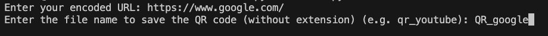

# QR Generator
QR Generator in Python

# How to run code:
1. Save this repository to your computer, and make sure you have installed `Python 3.12` or higher.
2. Open the folder in your computer from the command prompt/terminal.
    ```
    cd <your_folder_path>
    ```
3. Run this command to install necessary library.
    ```
    pip install requirements.txt
    ```
4. Run this command.
    ```
    python main.py
    ```
    or
    ```
    python3 main.py
    ```
5. Enter your url.
   
    
7. Enter the name of the file.
   
    
9. You can find the QR code image in the `results` folder.
